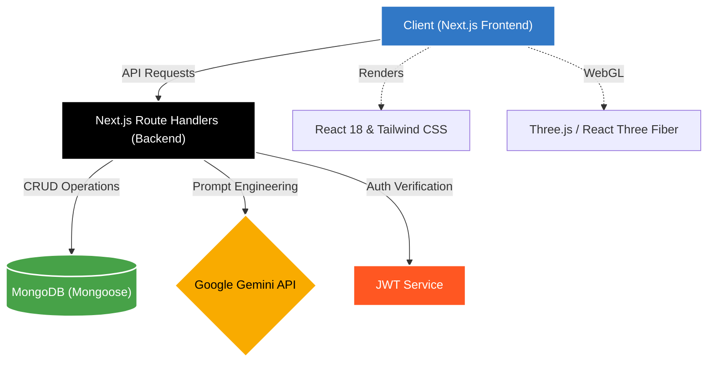

# College Event Portal


A modern, highly interactive, and AI-powered event management platform designed specifically for college campuses. It seamlessly connects students with upcoming events, workshops, and hackathons, while providing administrators with intelligent tools to streamline event logistics.

## Key Features

- **AI Event Planner**: Generate complete logistical event plans (budget, timeline, venue, marketing) using natural language through Google Gemini AI.
- **AI Conflict Detector**: Automatically scan the college calendar to detect and resolve venue or scheduling overlaps between different clubs.
- **Interactive 3D Interfaces**: An immersive, hardware-accelerated 3D background powered by **Three.js** and **React Three Fiber**.
- **Glassmorphism UI**: Stunning, modern, and translucent user interfaces that react to user interaction.
- **Responsive Design**: Fully optimized for mobile, tablet, and desktop viewing.
- **Secure Authentication**: Role-based access control (Student vs Admin) using JWT and encrypted passwords.
- **NoSQL Database**: Fast and flexible data storage using MongoDB and Mongoose.

## Core Functions & Workflow

### 1. Student Dashboard & Registration
- **Browse Events:** Students can view a feed of upcoming events, workshops, and hackathons hosted by various college clubs.
- **Seamless Registration:** One-click registration for events. The system tracks RSVPs and prevents double booking for limited-capacity events.
- **Personalized Calendar:** A dedicated view showing all the events a student is registered for, helping them manage their time effectively.

### 2. Admin Event Management
- **Create & Edit:** Club presidents and college administrators can manually create events with detailed descriptions, dates, and venue assignments.
- **Registration Tracking:** Admins can view a live dashboard of who has registered for their events, download attendee lists, and monitor capacity limits.

### 3. AI Event Planner (Powered by Gemini)
- **Natural Language Prompts:** Admins can simply type "Plan a 24-hour coding hackathon for 300 students next weekend".
- **Instant Logistics:** The AI instantly generates a comprehensive plan including:
  - **Estimated Budget:** Broken down by food, prizes, and marketing.
  - **Volunteers Needed:** Estimated staff required for smooth execution.
  - **Venue Suggestions:** Based on the requested capacity.
  - **Marketing Assets:** Auto-generated social media captions and email drafts.
- **One-Click Draft:** Admins can click "Create This Event" to automatically transfer the AI-generated logistics directly into the Event Creation form.

### 4. AI Conflict Detector
- **Automated Scanning:** Scans the entire college database for overlapping dates, times, and venues across different clubs.
- **Intelligent Resolution:** If two clubs accidentally book the "Main Auditorium" on the same day, the AI flags the conflict and suggests alternative venues or timing shifts to resolve the double-booking.

## System Architecture



## Technology Stack

- **Frontend**: Next.js 14, React 18, Tailwind CSS
- **3D Graphics**: Three.js, React Three Fiber, React Three Drei
- **Backend API**: Next.js Route Handlers
- **Database**: MongoDB (via Mongoose)
- **AI Integration**: Google Generative AI SDK (`gemini-flash-latest`)
- **Authentication**: JWT & bcryptjs

## Getting Started (Local Development)

1. **Clone the repository**
   ```bash
   git clone https://github.com/Sahrudhay31/college-event-portal.git
   cd college-event-portal
   ```

2. **Install Dependencies**
   ```bash
   npm install --legacy-peer-deps
   ```
   *(Note: `--legacy-peer-deps` is required for Three.js compatibility with Next.js 14)*

3. **Environment Variables**
   Create a `.env.local` file in the root directory:
   ```env
   MONGODB_URI=mongodb://localhost:27017/college-events
   JWT_SECRET=your_super_secret_key
   GEMINI_API_KEY=your_google_gemini_api_key
   ```

4. **Run the Development Server**
   ```bash
   npm run dev
   ```
   Open [http://localhost:3000](http://localhost:3000) to view the portal.

## Docker Deployment (Production)

The application is fully containerized and optimized for production using Next.js standalone output.

1. Ensure Docker and Docker Compose are installed.
2. Provide your API key in the `.env` file or export it:
   ```bash
   export GEMINI_API_KEY="your_api_key_here"
   ```
3. Build and run the containers:
   ```bash
   docker-compose up -d --build
   ```
4. The application will be accessible at `http://localhost:8080`.

## About the Developer

Designed and built with passion by **Sahrudhay**.

- [GitHub Profile](https://github.com/Sahrudhay31)
- [LinkedIn](https://www.linkedin.com/in/sahrudhay-chirra/)
- [Portfolio](https://sahrudhay31.github.io/Portfolio-Website/)

---
*&copy; 2026 College Event Portal. All rights reserved.*
